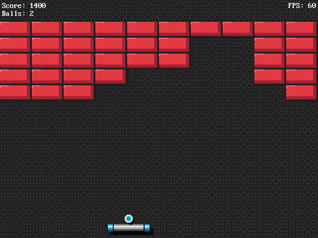

# Brickbonker

This is a Breakout game that was thrown together as an experiment in using the `specs`, `nphysics`, `rodio`, and `gfx-hal` crates together. The player can use the *A*/*D* or *Left*/*Right* keys to move the paddle, while *Spacebar* will launch the ball if it's docked on the paddle.

  

## Compiling and Running
`cargo run --release`

Note that the shaders located at `gfx-lib/res/shaders/src` will need to be recompiled if any changes are made to them. This is not handled automatically by the build process, but the original pre-compiled shader files are included in this repository.

The game (should) run on macOS (with Metal), Linux (with Vulkan), and Windows 10 (with DirectX 12).

## License
[zlib license](LICENSE.md)